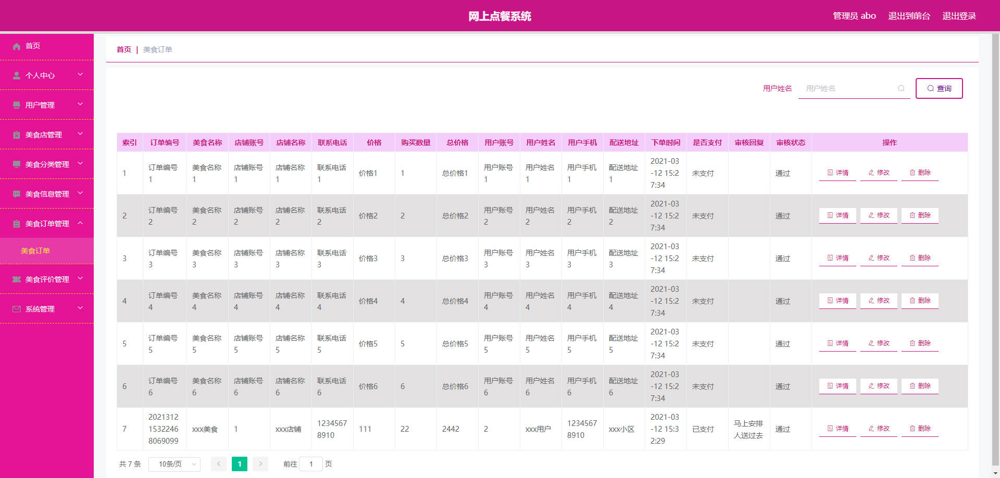
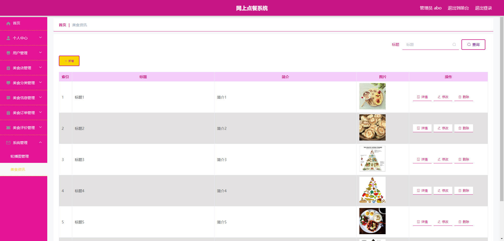

# 基于Springboot的网上点餐系统

## Springboot-0027


## 技术栈

Springboot mybatisplus vue mysql maven


## 数据库表(11张)


## 功能介绍

```properties
管理员；首页、个人中心、用户管理、美食店管理、美食分类管理、美食信息管理、美食订单管理、美食评价管理、系统管理，用户；首页、个人中心、美食订单管理、美食评价管理、我的收藏管理，美食店；首页、个人中心、美食信息管理、美食订单管理、美食评价管理，前台首页；首页、美食店、美食信息、美食评价、美食资讯、个人中心、后台管理等功能，
```


## 图片

### 前台


### 后台








## 访问路径

### 前台

```properties
http://localhost:8080/springboott01gx/front/pages/login/login.html

账号 2
密码 2
```

### 后台

```properties
http://localhost:8080/springboott01gx/admin/dist/index.html#/login

账号 abo
密码 abo
```


## 功能图


## 文档目录


## 打赏或交流


